---
## Front matter
title: "Лабораторная работа 1"
subtitle: "Дисциплина - основы информационной безопасности"
author: "Тимофеева Екатерина Николаевна"

## Generic otions
lang: ru-RU
toc-title: "Содержание"

## Bibliography
bibliography: bib/cite.bib
csl: pandoc/csl/gost-r-7-0-5-2008-numeric.csl

## Pdf output format
toc: true # Table of contents
toc-depth: 2
lof: true # List of figures
lot: true # List of tables
fontsize: 12pt
linestretch: 1.5
papersize: a4
documentclass: scrreprt
## I18n polyglossia
polyglossia-lang:
  name: russian
  options:
	- spelling=modern
	- babelshorthands=true
polyglossia-otherlangs:
  name: english
## I18n babel
babel-lang: russian
babel-otherlangs: english
## Fonts
mainfont: PT Serif
romanfont: PT Serif
sansfont: PT Sans
monofont: PT Mono
mainfontoptions: Ligatures=TeX
romanfontoptions: Ligatures=TeX
sansfontoptions: Ligatures=TeX,Scale=MatchLowercase
monofontoptions: Scale=MatchLowercase,Scale=0.9
## Biblatex
biblatex: true
biblio-style: "gost-numeric"
biblatexoptions:
  - parentracker=true
  - backend=biber
  - hyperref=auto
  - language=auto
  - autolang=other*
  - citestyle=gost-numeric
## Pandoc-crossref LaTeX customization
figureTitle: "Рис."
tableTitle: "Таблица"
listingTitle: "Листинг"
lofTitle: "Список иллюстраций"
lotTitle: "Список таблиц"
lolTitle: "Листинги"
## Misc options
indent: true
header-includes:
  - \usepackage{indentfirst}
  - \usepackage{float} # keep figures where there are in the text
  - \floatplacement{figure}{H} # keep figures where there are in the text
---

# Цель работы

Целью данной работы является приобретение практических навыков установки операционной системы на виртуальную машину, настройки минимально необходимых для дальнейшей работы сервисов.

# Задание

1. Установить на виртуальную машину операционной системы Linux дистрибутив Rocky
2. Выполнить домашнее задание
3. Контрольные вопросы

# Теоретическое введение

Rocky Linux - это корпоративная операционная система с открытым исходным кодом, разработанная для 100% совместимости с Red Hat Enterprise Linux®. Интенсивно разрабатывается сообществом.

                                                             
# Выполнение лабораторной работы

Подготовка виртуальной машины к установке Создаем новую виртуальную машину. Для этого в VirtualBox выберем "Машина" "Создать". Укажем имя виртуальной машины (рис. [-@fig:001]), (рис. [-@fig:002])

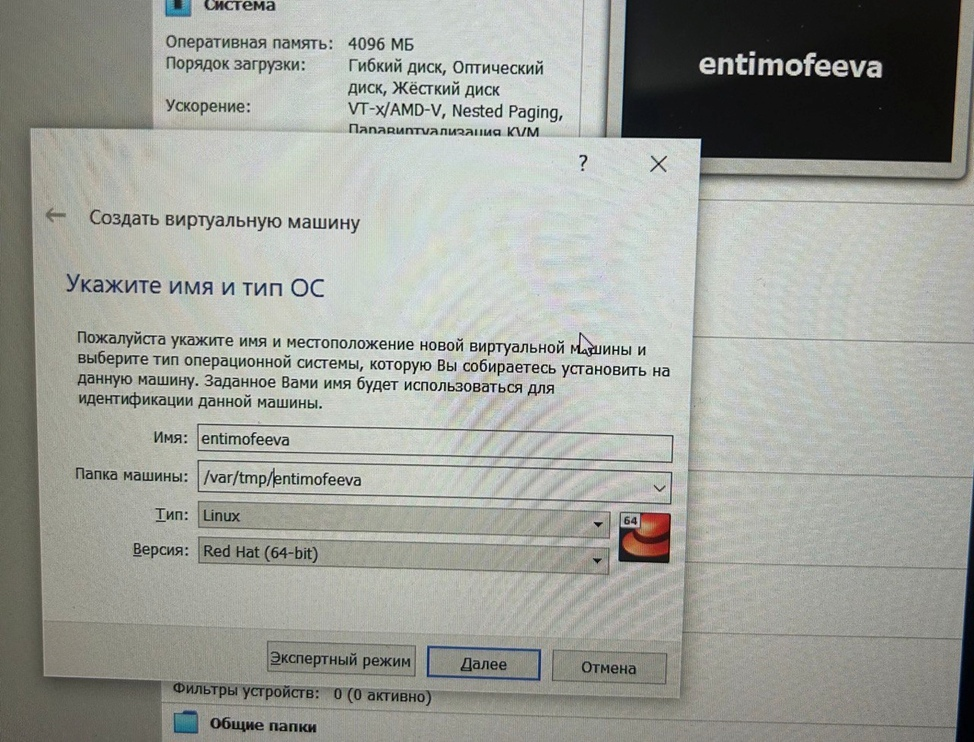{#fig:001 width=70%}

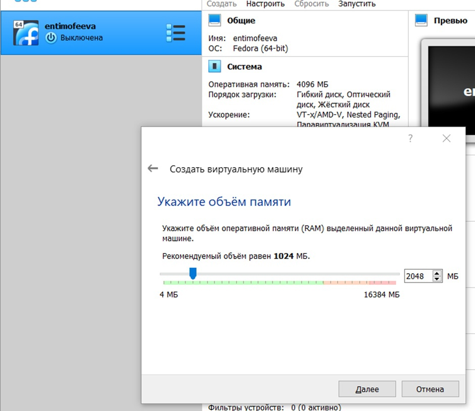{#fig:002 width=70%}

Задаём конфигурацию жёсткого диска — загрузочный,VDI (BirtualBox Disk Image), динамический виртуальный диск (рис. [-@fig:003]), (рис. [-@fig:003])

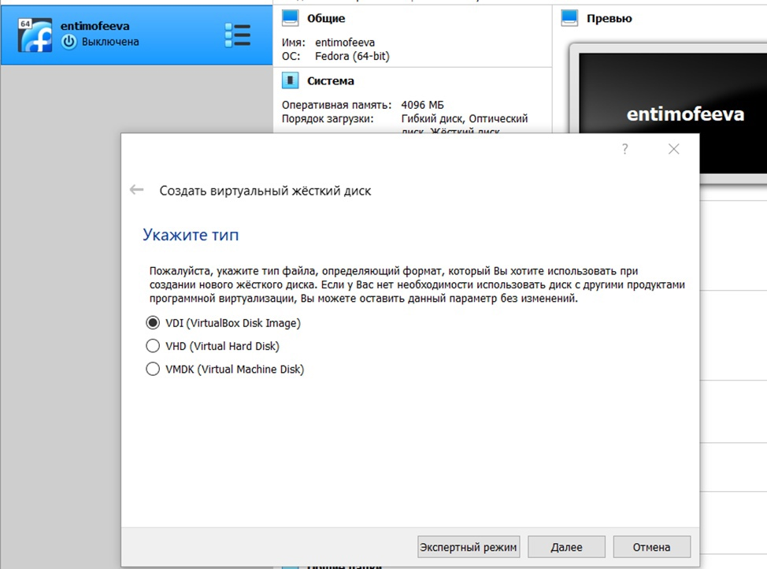{#fig:003 width=70%}

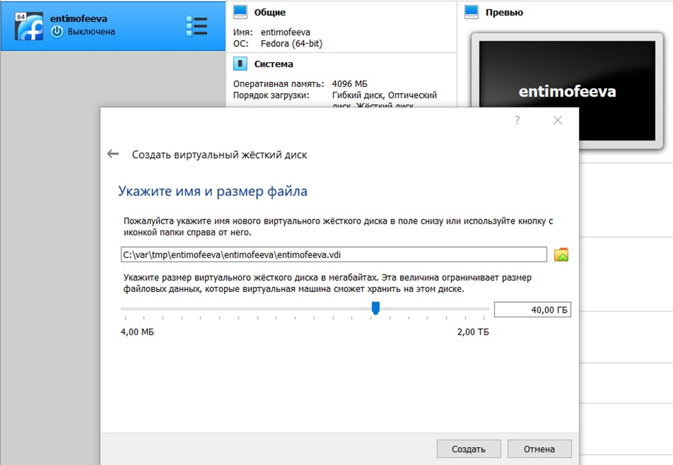{#fig:004 width=70%}

Установка Rocky Linux
Выбираем язык English и язык English (United States). (рис. [-@fig:005])

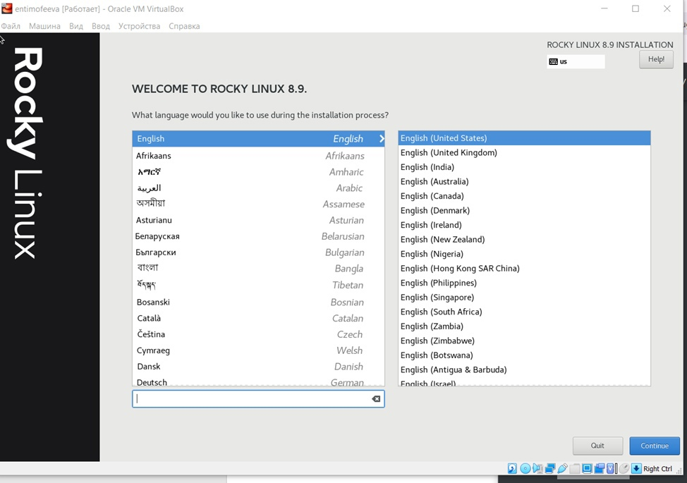{#fig:005 width=70%}

Выбираем автоматическую разметку диска.
Добавляем нового пользователя, учитывая соглашение об именовании
В предустанавливаемом ПО выбираем базовое окружение "Сервер с GUI" и группу "Developments tool". (рис. [-@fig:006]), (рис. [-@fig:007])

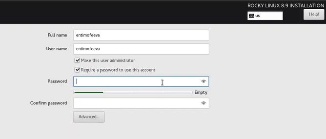{#fig:006 width=70%}

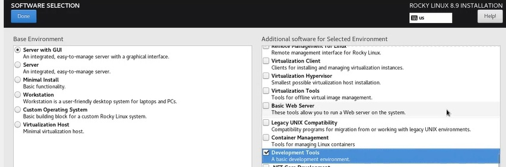{#fig:007 width=70%}

Отключаем kdump.

Запускаем установку.

# Выполнение домашнего задания

В окне терминала получаем следующую информацию. (рис. [-@fig:008]), (рис. [-@fig:009]), (рис. [-@fig:0010]), (рис. [-@fig:0011])

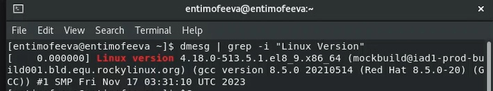{#fig:008 width=70%}

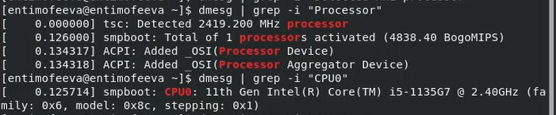{#fig:009 width=70%}

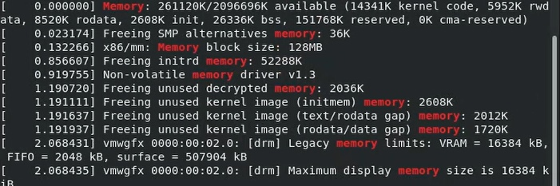{#fig:0010 width=70%}

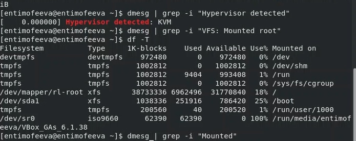{#fig:0011 width=70%}

# Выводы

По итогам выполнения работы, я настроил виртуальную машину с Rocky Linux.

# Контрольные вопросы

1. Учётная запись, как правило, содержит сведения, необходимые для опознания пользователя при подключении к системе, сведения для авторизации и учёта. Это идентификатор пользователя (login) и его пароль. Пароль или его аналог, как правило, хранится в зашифрованном или хэшированном виде для обеспечения его безопасности.

2. manual (man) — для получения полной справочной информации по другой команде.

Для перемещения и переименования файлов и каталогов используется команда mv. (Move)

Для просмотра содержимого каталога используется команда ls.

Для просмотра размеров папок на диске используется команда du.

touch — создать файл

Для удаления директорий используется команда rmdir имя_директории.

Команда rm применяется для удаления ненужных файлов.

Команда chmod (change mode – сменить режим) предназначена для изменения прав доступа к файлам

Достаточно выполнить команду history

3. Файловая система — это структура, используемая операционной системой для организации и управления файлами на устройстве хранения, например на жестком диске, твердотельном накопителе (SSD) или USB-накопителе.
4. Команда findmnt — это простая утилита командной строки, используемая для отображения списка смонтированных файловых систем или поиска файловой системы в /etc/fstab, /etc/mtab и /proc/self/mountinfo.
5. Один из способов «убить», запущенное приложение в Linux, это использование таких команд, как kill или killall.

# Список литературы{.unnumbered}

Кулябов Д.С. "Материалы к лабораторной работе"
